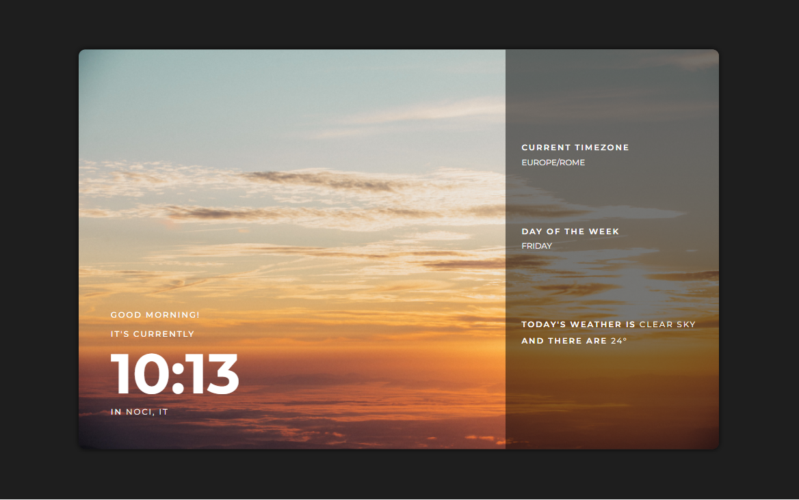

# Clock app

Simple clock app (completely responsive) which displays the current time, the day of the the week and the general weather.
Made by using two different APIs: worldtimeapi and openweathermap.

